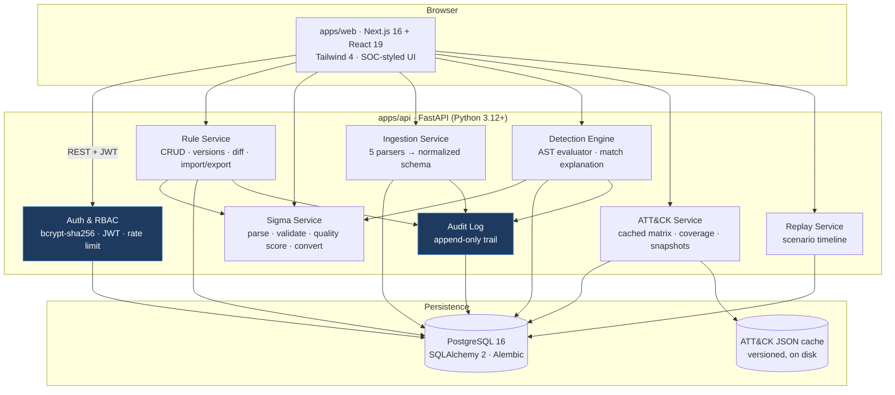
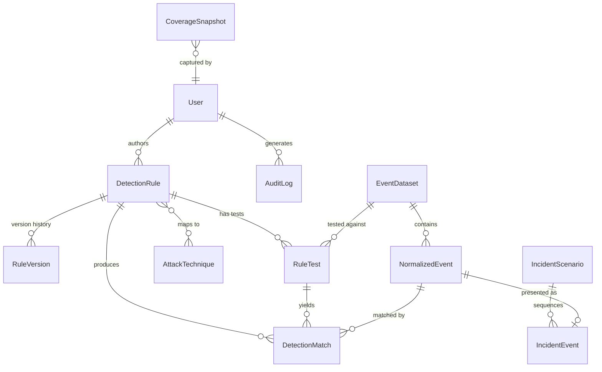
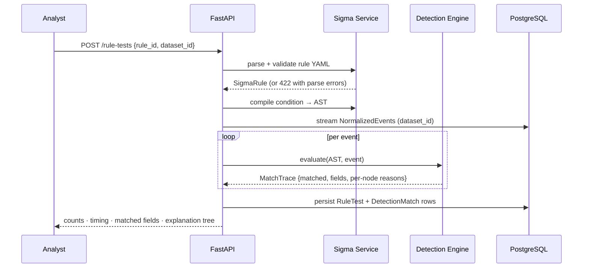

# SentinelForge — Architecture

SentinelForge is a **detection-engineering and incident-replay platform**. Analysts author or
import Sigma rules, validate and score them, execute them against normalized security event
datasets, replay incidents on a timeline, and measure MITRE ATT&CK coverage.

> **Scope statement.** SentinelForge is strictly defensive. It reads *user-supplied or synthetic*
> event data that is already at rest. It has no collectors, no agents, no network scanning, no
> remote execution, and no outbound data paths. See [`docs/threat-model.md`](docs/threat-model.md).

---

## 1. System overview



**Deliberately absent:** message broker, task queue, external collectors. Detection runs are
synchronous and bounded (see §4.4). Redis is *not* a dependency — it was evaluated and rejected
because no current workload is long-running enough to need out-of-process scheduling. The
extension point is documented in §7.

---

## 2. Monorepo layout

```
SentinelForge/
├── apps/
│   ├── api/                         # FastAPI backend
│   │   ├── sentinelforge/
│   │   │   ├── core/                # config, security, dependencies, errors
│   │   │   ├── models/              # SQLAlchemy ORM (12 entities)
│   │   │   ├── schemas/             # Pydantic request/response contracts
│   │   │   ├── api/routes/          # HTTP routers
│   │   │   ├── services/            # business logic (engine, sigma, ingest…)
│   │   │   ├── seed/                # demo rules, datasets, scenarios
│   │   │   └── data/                # versioned ATT&CK cache
│   │   ├── alembic/                 # migrations
│   │   └── tests/                   # unit · integration · security · e2e
│   └── web/                         # Next.js frontend
│       ├── src/app/                 # App Router pages
│       ├── src/components/          # accessible reusable components
│       └── src/lib/                 # API client, types, hooks
├── docs/                            # threat model, API, DB, walkthrough…
├── scripts/                         # ATT&CK refresh, dev helpers
└── docker-compose.yml
```

---

## 3. Data model

Twelve entities. Full column-level detail and an ERD live in
[`docs/database.md`](docs/database.md).



Conventions applied to every table:

| Concern | Decision |
|---|---|
| Primary key | `UUID` (server-generated, `uuid4`) — no enumerable integer IDs |
| Timestamps | `created_at` / `updated_at`, timezone-aware UTC, DB-side defaults |
| Deletes | Soft-delete via `archived_at` on rules; hard delete requires admin + audit record |
| Indexes | Every FK; plus composite indexes on hot query paths (§3.1) |
| Constraints | FK `ON DELETE` rules, `CHECK` on enums, `UNIQUE` on natural keys |

### 3.1 Notable indexes

- `normalized_event (dataset_id, timestamp)` — timeline scans and replay ordering
- `detection_match (rule_test_id, matched)` — result pagination
- `rule_version (rule_id, version_number DESC)` — version history and diff
- `detection_rule (status, severity)` + GIN-style tag lookup — dashboard aggregates
- `audit_log (created_at DESC)`, `audit_log (actor_id, action)` — audit review

### 3.2 Portability layer

PostgreSQL is the production target. Two SQLAlchemy `TypeDecorator`s (`GUID`, `JSONBType`) emit
native `UUID`/`JSONB` on PostgreSQL and `CHAR(32)`/`JSON` on SQLite, so the **entire test suite
runs on in-memory SQLite with no container**, while migrations and deployment target real
PostgreSQL. This keeps CI fast and hermetic without forking the models.

---

## 4. Detection engine

The engine is the intellectual core of the project and the reason SentinelForge is more than a
rule CRUD app.

### 4.1 Why an in-process AST evaluator

The obvious implementation is "convert Sigma to a SIEM query and run it." That requires a SIEM.
The second option is shelling out to `sigma convert`. Both were rejected:

| Approach | Verdict |
|---|---|
| Convert → external SIEM | Needs infrastructure SentinelForge does not own; unusable in a portfolio demo |
| `subprocess` to Sigma CLI | Introduces a command-execution surface for untrusted rule content, plus process overhead per run |
| **In-process AST evaluation** | **Chosen.** No shell, no subprocess, no injection surface. Full introspection → per-condition explanations |

The security consequence is significant: **SentinelForge never constructs a shell command from
rule or event content, because it never spawns a process at all.** That eliminates the entire
command-injection class rather than mitigating it. Sigma→query *conversion* (offered as a
read-only convenience for analysts) also runs in-process through pySigma backends.

### 4.2 Evaluation pipeline



### 4.3 Semantics implemented

pySigma normalizes modifiers into value types before evaluation, so the engine handles a small,
well-defined set:

| Sigma construct | Engine behaviour |
|---|---|
| `SigmaString` (incl. `contains`/`startswith`/`endswith`/`windash`) | `to_regex()` → case-insensitive full match |
| `SigmaNumber` | numeric equality with string coercion |
| `SigmaNull` (`field: null`) | matches when field is absent or `None` |
| `SigmaRegularExpression` (`\|re`) | compiled regex, `search`, honours Sigma flags |
| `SigmaCIDRExpression` (`\|cidr`) | `ipaddress` network containment |
| `SigmaCompareExpression` (`\|lt \|lte \|gt \|gte`) | numeric comparison |
| `SigmaExpansion` (`\|base64offset`) | OR across expanded encodings |
| Keyword (bare list) | match across all resolvable field values |
| `and` / `or` / `not`, `1 of`, `all of` | boolean AST nodes |

Sigma spec conformance notes: string matching is **case-insensitive**, values in a list are
**OR**-ed, fields within one selection are **AND**-ed, and a missing field **does not match**
(except an explicit `null`).

**Correlation rules** (`event_count`, `value_count`, temporal) are supported in a functional
minimum form — grouping and thresholding over a timespan — which is what the brute-force demo
scenario requires. Sequence-ordered `temporal_ordered` correlation is a documented gap (§7).

### 4.4 Bounds

Every run is bounded by `DETECTION_MAX_EVENTS` (default 100 000) and a wall-clock budget. Regexes
compiled from rule content run against per-event field values only, and rules exceeding a
complexity ceiling are rejected at validation time — a rule author is a trusted-but-fallible role,
not an anonymous input source, but ReDoS is still cheap to defend against.

### 4.5 Field taxonomy

Sigma rules use log-source-native field names (`Image`, `ParentImage`, `TargetUserName`, `c-uri`).
Events are stored in a normalized schema. A taxonomy layer resolves them:

```
Sigma field ──► canonical normalized column   (Image → process_name)
            └─► raw_event exact key           (fallback)
            └─► raw_event case-insensitive    (fallback)
            └─► unresolved → no match         (recorded in the explanation)
```

Unresolved fields are surfaced in test output, because *"the rule didn't match because the field
doesn't exist in this dataset"* is a completely different finding from *"the rule didn't match
because the value differed"* — and conflating them is how detection engineers ship blind rules.

---

## 5. Event normalization

Five input formats are parsed into one schema:

| Format | Detection heuristic |
|---|---|
| Generic JSON / JSONL | fallback |
| Windows Event Log JSON (exported) | `System`/`EventData` envelope or `Event.System` |
| Sysmon-style | Windows envelope with Sysmon channel / `EventID` in Sysmon range |
| Linux authentication | `sshd`/`sudo`/PAM message shapes |
| Web server access | `c-uri`/`cs-method` or combined-log-format keys |

Normalized fields: `timestamp`, `host`, `user`, `source_ip`, `dest_ip`, `process_name`,
`parent_process`, `command_line`, `event_id`, `log_source`, `action`, `file_hash`, `raw_event`.

`raw_event` always preserves the original record verbatim — normalization is **additive and
lossless**, so an analyst can always see what the source actually said.

---

## 6. Security architecture

Full analysis in [`docs/threat-model.md`](docs/threat-model.md). Controls at a glance:

| Surface | Control |
|---|---|
| Passwords | bcrypt (cost 12) over a SHA-256+base64 pre-hash — avoids bcrypt's 72-byte truncation and NUL-byte issues |
| Sessions | Short-lived JWT access token + rotating refresh token; `jti` denylist on logout |
| Auth endpoints | Per-IP and per-account rate limiting with lockout backoff |
| Roles | `admin` / `analyst`, enforced by dependency injection, default-deny |
| YAML | `yaml.safe_load` only — never `load`/`unsafe_load`; size- and depth-bounded |
| ZIP import | Path-traversal rejection, symlink rejection, entry count/size caps, compression-ratio (zip-bomb) check |
| Uploads | Extension allowlist, magic-byte check, hard size cap, streamed to bounded temp storage |
| SQL | SQLAlchemy parameter binding exclusively; no string-built SQL |
| Command exec | **None.** No `subprocess`, no `os.system`, no shell anywhere in the request path |
| Audit | Append-only records for rule change, import, export, test, delete, auth events |
| Secrets | Env-only; startup refuses to boot with a default/placeholder `SECRET_KEY` outside dev |

---

## 7. Known limitations & extension points

Documented honestly rather than hidden — see [`docs/roadmap.md`](docs/roadmap.md).

| Limitation | Extension point |
|---|---|
| Detection runs synchronously | `services/detection_runner.py` is queue-shaped: swap the direct call for a Celery/RQ task without touching callers |
| `temporal_ordered` correlation unsupported | Correlation evaluator dispatches on type; add a case |
| ATT&CK cache is a bundled snapshot | `scripts/refresh_attack.py` regenerates from the official MITRE CTI bundle |
| Single-tenant | No `tenant_id` — adding one is a migration plus a query filter in `deps.py` |
| Coverage counts rules, not efficacy | Deliberate. Surfaced in the UI as a caveat, not a score to game |

---

## 8. Technology decisions

| Choice | Rationale |
|---|---|
| FastAPI + Pydantic v2 | Typed request/response contracts, generated OpenAPI, native async |
| SQLAlchemy 2.0 typed ORM | `Mapped[...]` annotations give real mypy coverage over the data layer |
| pySigma 1.4 | The reference Python implementation; parsing *and* 31 validators come free |
| Next.js 16 App Router | Server components for data-heavy tables, client islands for interactivity |
| Tailwind 4 | CSS-first config; design tokens as CSS variables drive light/dark without a JS theme layer |
| bcrypt direct (not passlib) | passlib 1.7.4 is unmaintained and **broken** against bcrypt 5.x (`__about__` removal) |
| SQLite for tests | Hermetic CI with no service containers; PostgreSQL remains the deployment target |
