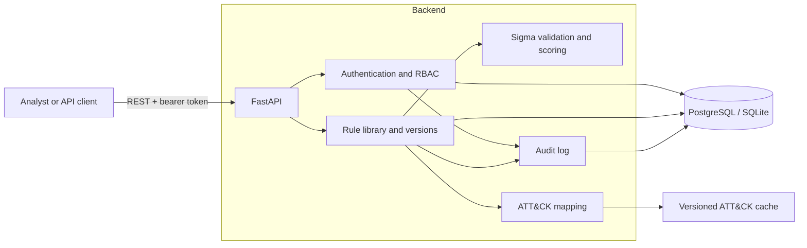
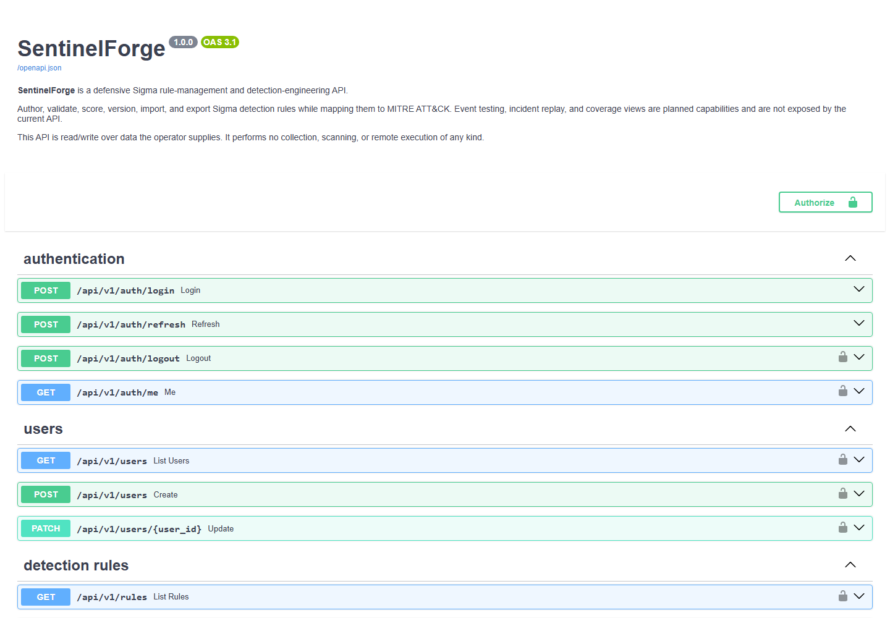
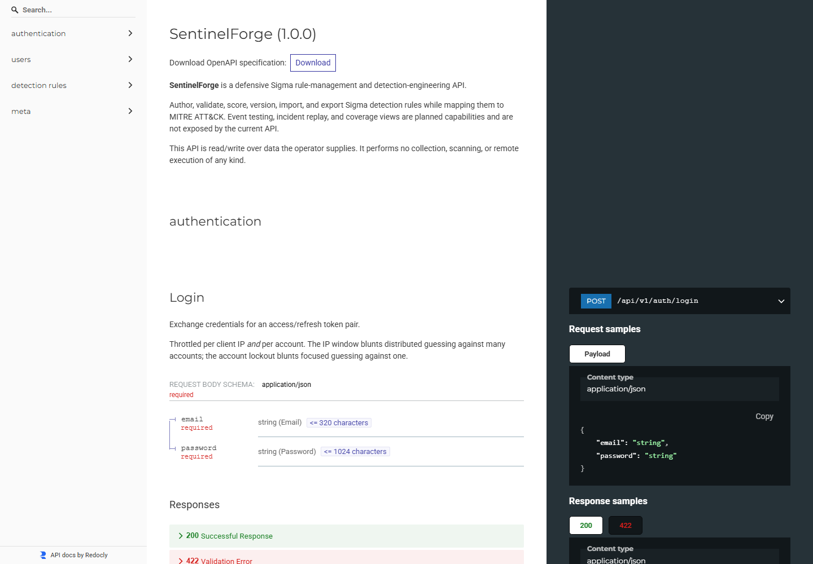

<div align="center">

# SentinelForge

**A security-first workspace for building, reviewing, and managing Sigma detection rules.**

[](https://github.com/stariik/SentinelForge/actions/workflows/ci.yml)
[](https://www.python.org/)
[](https://fastapi.tiangolo.com/)
[](LICENSE)

</div>

SentinelForge turns a folder of detection rules into a searchable, versioned, and
auditable rule library. Analysts can safely import Sigma YAML, validate it with pySigma,
inspect an explainable quality score, map rules to MITRE ATT&CK, review changes, and
export the library again through a typed REST API.

> **Current status:** the FastAPI backend, authentication foundation, Sigma core, and
> rule-management API are implemented. Event ingestion, rule execution, incident replay,
> ATT&CK coverage views, and the web interface are planned work. See the
> [delivery plan](TASKS.md) for milestone-level progress.

## What works today

- Safe Sigma parsing with input size and nesting limits, `yaml.safe_load`, and pySigma's
  core validators.
- Explainable rule-quality scoring across metadata, detection logic, ATT&CK mapping,
  false-positive guidance, references, tests, status, and descriptive content.
- Rule CRUD, duplication, reversible archiving, and admin-only permanent deletion.
- Immutable version history with unified diffs and restore-as-a-new-version semantics.
- Search, pagination, and filters for status, severity, log source, author, tags, ATT&CK
  techniques, archived rules, and untested rules.
- Single-file YAML and bounded ZIP imports, plus individual and bulk exports.
- A bundled MITRE ATT&CK Enterprise v19.1 snapshot with 15 tactics and 697 techniques.
- JWT access and rotating refresh tokens, bcrypt password hashing, account lockout,
  login throttling, analyst/admin RBAC, and audit logging.
- PostgreSQL-native persistence with a SQLite portability layer for local development
  and hermetic tests.

## Architecture



The service is synchronous by design: rule parsing and bounded evaluation work are
CPU-oriented, while FastAPI runs synchronous endpoints in its thread pool. SQLAlchemy
models use native UUID/JSONB types on PostgreSQL and compatible UUID/JSON types on
SQLite.

For the longer design rationale, data flows, and planned detection engine, read
[ARCHITECTURE.md](ARCHITECTURE.md).

## Screenshots

### Interactive API explorer



### Generated API reference



## Quick start

Requirements:

- Python 3.12 or newer
- Git
- PostgreSQL for a production-like environment; SQLite is sufficient for local use

From a fresh clone, enter the API package and create a virtual environment:

```bash
git clone https://github.com/stariik/SentinelForge.git
cd SentinelForge/apps/api
python -m venv .venv
```

Activate it with `.venv\Scripts\Activate.ps1` on Windows PowerShell or
`source .venv/bin/activate` on macOS/Linux, then install the project:

```bash
python -m pip install --upgrade pip
python -m pip install -e ".[dev]"
```

Copy the example configuration into `apps/api/.env`:

```powershell
# Windows PowerShell
Copy-Item ..\..\.env.example .env
```

```bash
# macOS/Linux
cp ../../.env.example .env
```

For a zero-dependency local database, change this line in `.env`:

```dotenv
DATABASE_URL=sqlite:///./sentinelforge.db
```

Apply the schema and start the API:

```bash
python -m alembic upgrade head
python -m uvicorn sentinelforge.main:app --reload
```

Open <http://localhost:8000/docs> for the interactive OpenAPI interface or check
<http://localhost:8000/health> for service health.

### Create the first administrator

Self-service registration is intentionally disabled. In a trusted development shell,
start `python` and create the initial administrator once:

```python
from getpass import getpass

from sentinelforge.core.db import get_session_factory
from sentinelforge.models.enums import UserRole
from sentinelforge.services.auth import create_user

db = get_session_factory()()
create_user(
    db,
    email="you@example.com",
    password=getpass("New administrator password: "),
    full_name="Local Administrator",
    role=UserRole.ADMIN,
)
db.commit()
db.close()
```

Use `POST /api/v1/auth/login` to obtain an access/refresh token pair. Select
**Authorize** in the API docs and provide the access token to call protected endpoints.
The administrator can create analyst accounts through `POST /api/v1/users`.

## API map

| Area | Main endpoints | Access |
|---|---|---|
| Service | `GET /health`, `/docs`, `/redoc`, `/openapi.json` | Public |
| Authentication | `/api/v1/auth/login`, `/refresh`, `/logout`, `/me` | Mixed |
| Users | `GET/POST /api/v1/users`, `PATCH /api/v1/users/{id}` | Admin |
| Rules | CRUD, validate, duplicate, archive, search, and filters under `/api/v1/rules` | Analyst |
| Versions | History, detail, diff, and restore under `/api/v1/rules/{id}` | Analyst |
| Import/export | Single YAML and ZIP archive operations under `/api/v1/rules` | Analyst |

The running service's OpenAPI document is the authoritative endpoint and schema
reference.

## Security model

SentinelForge is strictly defensive. It reads operator-supplied or synthetic data at
rest; it has no collectors, agents, network scanner, remote execution, or outbound data
pipeline.

Important safeguards include:

- no shell or subprocess execution for rule parsing or query rendering;
- bounded YAML parsing and in-memory-only archive handling;
- ZIP traversal, absolute-path, symlink, entry-count, expanded-size, and compression-ratio
  checks;
- default-deny authenticated routes with explicit analyst/admin dependencies;
- production startup refusal when the example secret is still configured; and
- short-lived access tokens plus single-use refresh-token rotation.

This is an actively developed engineering project, not a production SIEM. Review the
[threat model](docs/threat-model.md) before exposing it to untrusted networks or data.

## Repository layout

```text
SentinelForge/
├── apps/api/                 FastAPI package, migrations, and tests
├── docs/                     Database contract and threat model
├── scripts/                  ATT&CK cache maintenance
├── .github/workflows/        Continuous integration
├── ARCHITECTURE.md           System design and engineering decisions
├── TASKS.md                  Phased delivery plan
└── .env.example              Documented configuration surface
```

## Development checks

Run these commands from `apps/api` before opening a pull request:

```bash
python -m ruff check .
python -m ruff format --check .
python -m mypy sentinelforge
python -m pytest -q
```

The tests use an in-memory SQLite database and do not require Docker or PostgreSQL.

## Roadmap

The next major capabilities are event ingestion and normalization, an in-process Sigma
condition evaluator with match explanations, detection test runs, ATT&CK coverage
snapshots, incident replay, a Next.js interface, demo content, and containerized
deployment. Progress and scope decisions are tracked in [TASKS.md](TASKS.md).

## Documentation

- [Architecture](ARCHITECTURE.md)
- [Database model and ERD](docs/database.md)
- [Threat model and security limitations](docs/threat-model.md)
- [Delivery plan](TASKS.md)
- [Backend package notes](apps/api/README.md)

## License

SentinelForge is available under the [MIT License](LICENSE).
