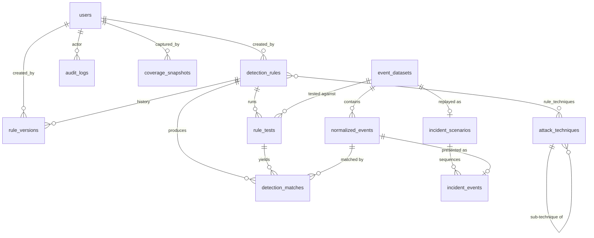

# Database Schema

PostgreSQL 16 is the deployment target. The test suite runs the same models on SQLite via two
`TypeDecorator`s (`GUID`, `JSONBType`) that emit `UUID`/`JSONB` on PostgreSQL and `CHAR(32)`/`JSON`
elsewhere.

**Universal conventions** — every table: `id UUID` primary key (`uuid4`, never sequential),
`created_at`/`updated_at` as timezone-aware UTC with server defaults, foreign keys indexed and given
explicit `ON DELETE` behaviour.

---

## Entity relationships

---

## Tables

### `users`
| Column | Type | Notes |
|---|---|---|
| `email` | `citext`-style lowercase text | `UNIQUE`, normalised on write |
| `full_name` | text | |
| `hashed_password` | text | bcrypt(cost 12) over SHA-256+base64 pre-hash |
| `role` | enum `admin` \| `analyst` | `CHECK` constrained, default `analyst` |
| `is_active` | bool | default `true` |
| `last_login_at` | timestamptz | nullable |
| `failed_login_count` | int | default 0 — drives lockout |
| `locked_until` | timestamptz | nullable |

> No user row is created at migration time. Demo accounts exist **only** after an explicit
> `python -m sentinelforge.seed` run.

### `detection_rules`
| Column | Type | Notes |
|---|---|---|
| `sigma_id` | UUID | the `id:` inside the rule YAML; nullable, indexed |
| `title` | text | `NOT NULL` |
| `description` | text | |
| `status` | enum | `draft`/`experimental`/`test`/`stable`/`deprecated`/`unsupported` |
| `severity` | enum | `informational`/`low`/`medium`/`high`/`critical` |
| `author` | text | |
| `logsource_category` / `_product` / `_service` | text | indexed for filtering |
| `tags` | JSONB | raw Sigma tags |
| `rule_references` | JSONB | `references:` (renamed — `references` is reserved) |
| `falsepositives` | JSONB | |
| `content` | text | canonical Sigma YAML, source of truth |
| `quality_score` | int 0–100 | |
| `quality_breakdown` | JSONB | per-criterion score + reason |
| `validation_status` | enum `valid`/`warnings`/`invalid` | |
| `validation_issues` | JSONB | validator id, severity, message |
| `is_demo` | bool | seeded educational rules |
| `archived_at` | timestamptz | soft delete |
| `current_version` | int | mirrors latest `rule_versions.version_number` |

Indexes: `(status, severity)`, `(archived_at)`, `(logsource_product, logsource_category)`, `(title)`.

### `rule_versions`
Immutable. `UNIQUE (rule_id, version_number)`; index `(rule_id, version_number DESC)`.
Columns: `content`, `change_summary`, `created_by_id`. Restoring an old version appends a **new**
version — history is never rewritten.

### `rule_tests`
`rule_id`, `dataset_id`, `rule_version_id`, `events_processed`, `events_matched`,
`execution_ms`, `expectation` (`should_match`/`should_not_match`), `passed`,
`error_message`, `notes`, `created_by_id`. Index `(rule_id, created_at DESC)`.

### `event_datasets`
`name` (`UNIQUE`), `description`, `format` enum, `source_filename`, `event_count`, `is_demo`,
`scenario_hint`.

### `normalized_events`
The normalization target. `dataset_id`, `sequence` (stable ordering), `timestamp`, `host`, `username`,
`source_ip`, `dest_ip`, `process_name`, `parent_process`, `command_line`, `event_id`, `log_source`,
`action`, `file_hash`, `raw_event` JSONB.

`raw_event` is **always** the verbatim source record — normalization is additive and lossless.

Indexes: `(dataset_id, sequence)`, `(dataset_id, timestamp)`, `(host)`, `(username)`, `(process_name)`.
`ON DELETE CASCADE` from dataset.

### `detection_matches`
`rule_test_id`, `rule_id`, `normalized_event_id`, `matched` bool, `matched_fields` JSONB,
`explanation` JSONB (the condition trace tree). Index `(rule_test_id, matched)`.

Non-matching events are recorded only in summary counts by default; per-event non-match rows are
written when the run requests them, keeping table growth bounded.

### `incident_scenarios` / `incident_events`
Scenario: `name`, `summary`, `narrative`, `dataset_id`, `severity`, `is_demo`.
Event: `scenario_id`, `normalized_event_id`, `sequence`, `summary`, `analyst_note`, `severity`.
Index `(scenario_id, sequence)`.

### `attack_techniques`
Synced from the bundled cache. `technique_id` (`T1059.001`) `UNIQUE`, `name`, `tactics` JSONB,
`is_subtechnique`, `parent_technique_id`, `platforms` JSONB, `description`, `url`, `attack_version`.

### `rule_techniques`
Association: `(rule_id, technique_id)` composite primary key, both FKs `ON DELETE CASCADE`.

### `coverage_snapshots`
`name`, `attack_version`, `total_techniques`, `covered_count`, `partial_count`, `uncovered_count`,
`detail` JSONB (per-technique state + rule ids), `created_by_id`. Enables snapshot diffing.

### `audit_logs`
Append-only. `actor_id` (`ON DELETE SET NULL`), `actor_email` (denormalised so the trail survives user
deletion), `action`, `entity_type`, `entity_id`, `detail` JSONB, `ip_address`.
Indexes `(created_at DESC)`, `(actor_id, action)`, `(entity_type, entity_id)`.

### `revoked_tokens`
`jti` `UNIQUE`, `expires_at`. Supports logout/refresh-rotation denylisting; expired rows are
prunable.

---

## Enum handling

Enums are stored as constrained strings rather than native PostgreSQL `ENUM` types. Native enums
require a migration to add a value, which is a poor trade for fields such as `status` that track an
external specification (Sigma) that changes independently of this project.
