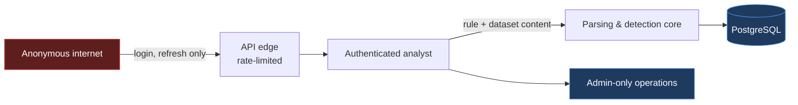

# Threat Model

Scope: the SentinelForge web application, its API, and its data at rest.

## 1. What this system is — and is not

SentinelForge is a **defensive analysis tool**. It reads security event data that is *already at
rest* and that the operator supplied deliberately.

It contains **no** collectors or agents, no network scanning or discovery, no remote command
execution, no credential harvesting, no persistence mechanisms, no exploit code, and no outbound
data path to third parties. Adding any of these would be out of scope by design, not merely
unimplemented.

## 2. Assets

| Asset | Why it matters |
|---|---|
| Detection rule content | Represents defensive posture; disclosure tells an adversary what is *not* detected |
| Event datasets | Synthetic here, but the same code path would hold real telemetry — hostnames, usernames, IPs, command lines |
| User credentials | Account takeover yields rule modification, i.e. silent detection sabotage |
| Audit log | The record of who changed what; its integrity is what makes the rest trustworthy |
| ATT&CK coverage data | Reveals visibility gaps |

## 3. Trust boundaries

The sharpest boundary is **uploaded content → parsing core**. An authenticated analyst is
trusted-but-fallible: they may upload a rule from an untrusted public repository or a dataset from a
compromised host. Uploaded bytes are therefore treated as hostile even though the uploader is not.

## 4. Risk register

| # | Threat | Vector | Mitigation | Residual |
|---|---|---|---|---|
| 1 | **Arbitrary code execution via YAML** | `!!python/object` in an imported rule | `yaml.safe_load` exclusively; loader never resolves Python tags. Size- and depth-bounded | Low |
| 2 | **Command injection** | Rule content reaching a shell | **No subprocess exists in the request path.** Sigma parsing and conversion are in-process library calls. The class is removed, not filtered | None by construction |
| 3 | **ZIP path traversal** | `../../etc/passwd` entry in a rule archive | Entry names normalised and rejected if absolute, containing `..`, or resolving outside the extraction root. Nothing is written to disk — entries are read into memory | Low |
| 4 | **Zip bomb / decompression DoS** | Highly compressed archive | Caps on entry count, per-entry uncompressed size, total uncompressed size, and compression ratio, all enforced *before* decompression using header metadata, then re-checked while streaming | Low |
| 5 | **Symlink escape** | Symlink entries in archive | External-attribute check rejects symlink entries | Low |
| 6 | **Oversized upload DoS** | Multi-GB file | Hard byte cap enforced while streaming; request rejected at the boundary, never buffered whole | Low |
| 7 | **ReDoS** | Catastrophic regex in `\|re` or a pathological wildcard | Pattern length and nesting ceiling at validation time; per-run wall-clock budget aborts a pathological run | Medium — see §6 |
| 8 | **SQL injection** | Filter/search parameters | SQLAlchemy bound parameters exclusively; no string-interpolated SQL anywhere | Low |
| 9 | **Broken access control** | Analyst performing admin actions | Default-deny dependency injection; every route declares its required role. Destructive operations are admin-only | Low |
| 10 | **Credential stuffing / brute force** | Repeated login attempts | Per-IP rate limit, per-account failure counter with timed lockout, uniform error message and constant-ish response time to avoid account enumeration | Low |
| 11 | **Weak password storage** | Database disclosure | bcrypt cost 12 over a SHA-256+base64 pre-hash — avoids bcrypt's silent 72-byte truncation and NUL-byte truncation without capping password length | Low |
| 12 | **Token replay after logout** | Stolen JWT | Short access-token TTL; refresh rotation; `jti` denylist checked on every refresh and logout | Medium — a stolen access token is valid until expiry |
| 13 | **Audit tampering** | Attacker covering tracks | Audit rows are append-only through the service layer; `actor_email` denormalised so the trail survives user deletion | Medium — a DB-level admin can still edit rows |
| 14 | **Stored XSS** | Rule title/description rendered in UI | React escapes by default; no `dangerouslySetInnerHTML` anywhere; raw events rendered as text in `<pre>`, never parsed as HTML | Low |
| 15 | **Secret disclosure** | Committed `.env` | `.env` git-ignored; `.env.example` carries placeholders only; app refuses to start with a default `SECRET_KEY` when not in dev | Low |
| 16 | **Detection sabotage** | Insider silently weakening a rule | Immutable version history plus audit records; every content change is diffable and attributable | Low |

## 5. Controls by layer

**Authentication** — bcrypt-sha256, JWT access (short TTL) + rotating refresh, `jti` denylist,
rate limiting, account lockout, no default credentials in any code path that runs automatically.

**Authorization** — two roles. `analyst`: author, import, test, export, annotate. `admin`:
everything plus hard delete, user management, and audit review. Enforced by FastAPI dependencies
that fail closed.

**Input validation** — Pydantic models on every request; upload allowlists by extension *and*
content sniffing; explicit numeric bounds on all pagination and limit parameters.

**Output** — no user content is ever interpolated into HTML, SQL, shell, or file paths.

## 6. Known limitations

Stated plainly, because a threat model that claims completeness is not a threat model.

1. **ReDoS is bounded, not eliminated.** Sigma permits arbitrary regex. Complexity limits and a
   run time budget are mitigations; a determined author with rule-write access can still degrade a
   run. Full elimination needs a non-backtracking engine (RE2), which is the documented upgrade path.
2. **Access tokens are not revocable before expiry.** Only refresh tokens are denylisted. TTL is
   kept short to bound exposure.
3. **Audit integrity is application-level.** No cryptographic chaining; a database administrator can
   alter history. Hash-chained entries are on the roadmap.
4. **Single-tenant.** No `tenant_id` and no row-level isolation. Do not host multiple untrusting
   organisations on one instance.
5. **No CSRF tokens** — the API is token-authenticated via an `Authorization` header and does not
   accept cookie-borne credentials, so classic CSRF does not apply. This assumption breaks if cookie
   auth is ever added.
6. **Not penetration tested.** This is a portfolio project. The controls above are implemented and
   unit-tested, but it has not undergone third-party assessment and should not be treated as
   production-hardened.
7. **Quality score is advisory.** It measures rule *hygiene* — metadata, tests, documentation — not
   detection efficacy. A rule can score 100 and detect nothing. This is stated in the UI too.
